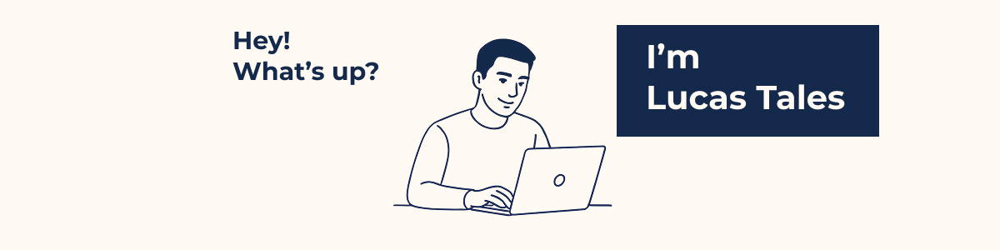
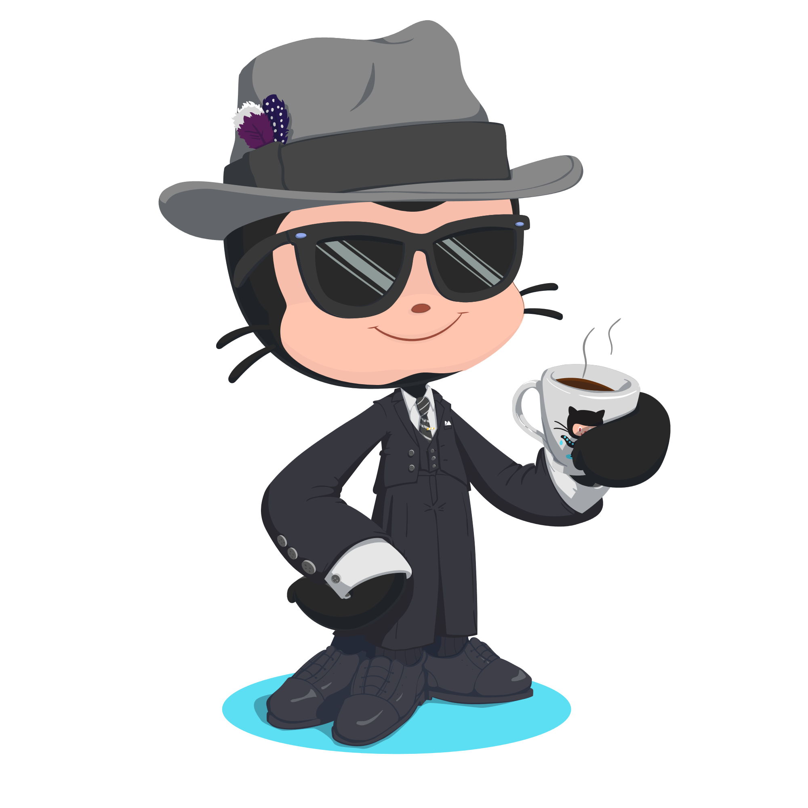

###

<h2 align="left">About me</h2>

<table>
  <tr>
    <td width="100%">
      

        Hello! My name is Lucas Tales and I'm an aspiring full-stack developer. 
        I enjoy transforming ideas into functional, modern, and attractive applications, 
        always seeking to learn new technologies and improve my skills.
      

    </td>
    <td align="center" width="40%">
      
    </td>
  </tr>
</table>

###

<h2 align="left">Technologies</h2>

  <h3>Backend<h3/>
  
  
  
  
  
  
  
  
  <h3>Frontend</h3>
  
  
  
  
  
  
  
  
  <h3>DevOps</h3>
  
  

###

  

  

