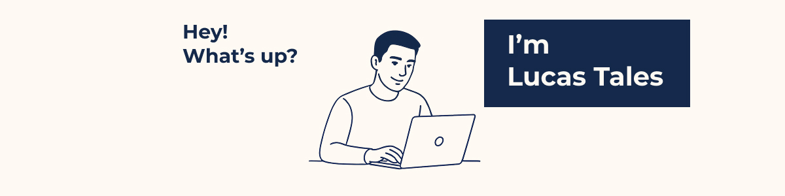

###

<h2 align="left">About me</h2>

<table border="0" cellspacing="0" cellpadding="0">
  <tr>
    <td style="vertical-align: middle; padding-right: 20px; border: none;" width="1000px">
      Hi, I'm Lucas Tales! I'm an undergraduate in Systems Analysis and Development at IFRN, combining a solid software engineering background with a strong focus on Data Analytics and Business Intelligence.
      Currently working as a Data Analyst Intern, I specialize in building Python automation scripts, optimizing complex SQL queries in production environments, and designing operational dashboards in Grafana with ERP data validation. My previous experience building RESTful APIs with Python (Django REST Framework) and PostgreSQL allows me to navigate data workflows effectively from database architecture to final visualization.
    </td>
    <td style="vertical-align: middle; border: none;">
      
    </td>
  </tr>
</table>

###

<h2 align="left">Technologies</h2>

###

<h2 align="left">Contact me</h2>

